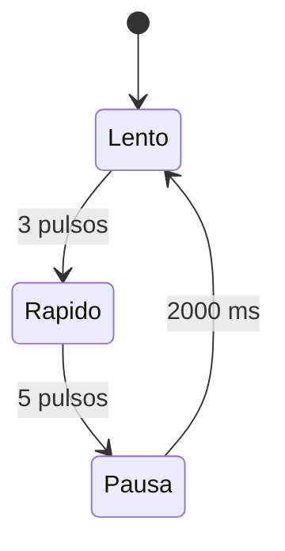
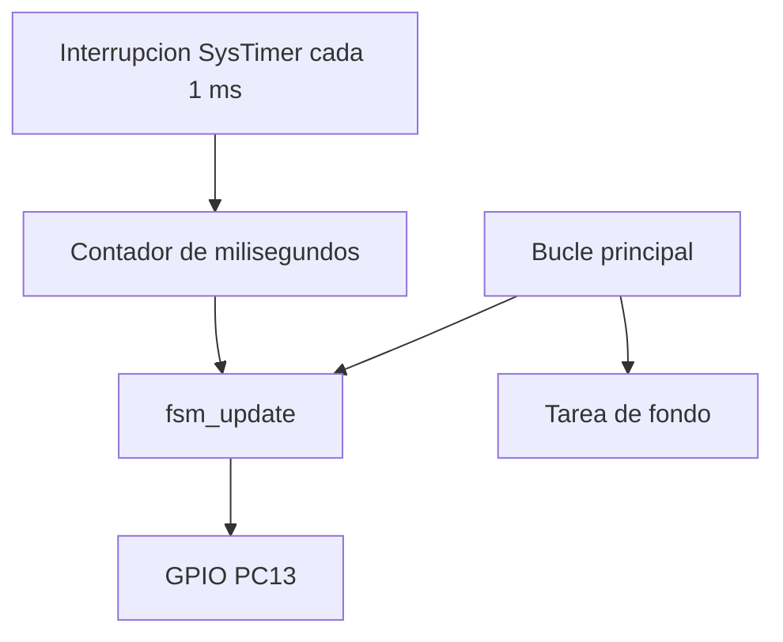

# Exercise 04 - Maquina de estados no bloqueante en GD32VW553

**Curso:** Estructuras Computacionales  
**Autora:** Laura Daniela Barragan Silva  
**Plataforma:** GD32VW553HMQ6/HMQ7  
**Arquitectura:** Nuclei RISC-V RV32  
**Entorno:** Visual Studio Code, CMake, Ninja, Nuclei RISC-V GCC y OpenOCD

## 1. Proposito

Este ejercicio implementa una maquina de estados finita (FSM) que controla el
LED PC13 sin detener el procesador mediante retardos bloqueantes. El tiempo
proviene de una interrupcion periodica de SysTimer cada 1 ms.

La practica permite estudiar:

- estados, eventos, acciones y transiciones;
- representacion de estados mediante `enum`;
- temporizacion no bloqueante;
- interrupciones y variables `volatile`;
- separacion entre la logica de control y el acceso al GPIO;
- ejecucion cooperativa de mas de una tarea dentro del bucle principal;
- observacion de una FSM mediante breakpoints y variables globales.

## 2. Resultado esperado

El LED repite indefinidamente:

1. tres pulsos lentos: 500 ms encendido y 500 ms apagado;
2. cinco pulsos rapidos: 150 ms encendido y 150 ms apagado;
3. una pausa apagada de 2000 ms;
4. regreso al primer estado.

La duracion aproximada del ciclo completo es:

```text
3 x (500 + 500) + 5 x (150 + 150) + 2000 = 6500 ms
```

## 3. Diagrama de estados



| Estado | Valor | Accion | Condicion de salida |
| --- | ---: | --- | --- |
| `FSM_SLOW_BLINK` | 0 | Conmutar cada 500 ms | 3 pulsos completos |
| `FSM_FAST_BLINK` | 1 | Conmutar cada 150 ms | 5 pulsos completos |
| `FSM_PAUSE` | 2 | Mantener LED apagado | 2000 ms transcurridos |

## 4. Arquitectura del programa



La interrupcion no controla directamente el LED. Solo actualiza el reloj del
sistema. El bucle principal consulta ese reloj y decide cuando ocurre cada
evento. Esto mantiene corto el manejador de interrupcion.

## 5. Evidencia de comportamiento no bloqueante

`g_background_iterations` aumenta continuamente mientras la FSM espera la
siguiente transicion. En un programa con `delay_ms()` bloqueante, esa tarea no
podria avanzar durante la espera.

Variables recomendadas para el depurador:

```text
g_fsm_state
g_completed_pulses
g_led_is_on
g_transition_count
g_completed_cycles
g_led_toggle_count
g_background_iterations
```

## 6. Estructura

```text
04_LED_Finite_State_Machine/
├── .vscode/
├── Doc/
│   ├── 1_SETUP.md
│   ├── 2_BUILD_AND_FLASH.md
│   ├── 3_CONCEPTS_AND_QUESTIONS.md
│   ├── 4_DEBUGGING.md
│   └── 5_TROUBLESHOOTING.md
├── Inc/
│   ├── gd32vw55x_libopt.h
│   └── systimer.h
├── Src/
│   ├── main.c
│   └── systimer.c
├── cmake/
├── tools/
├── CMakeLists.txt
└── CMakePresets.json
```

## 7. Preparacion rapida

1. Copie `tools/local_config.example.ps1` como
   `tools/local_config.ps1`, o reutilice el archivo de la guia general.
2. Abra esta carpeta como raiz en VS Code normal.
3. Ejecute `Verify GD32 Environment`.
4. Ejecute `Build + Flash GD32 FSM`.
5. Cree la configuracion de depuracion y observe las variables globales.

Las instrucciones completas estan en `Doc/`.

## 8. Dependencias externas

El proyecto usa `GD32VW55x_Firmware_Library_V1.6.0` desde una ruta local. No
publica el SDK, compilador, OpenOCD, rutas personales, `build/`, binarios,
`tools/local_config.ps1` ni `.vscode/launch.json`.
